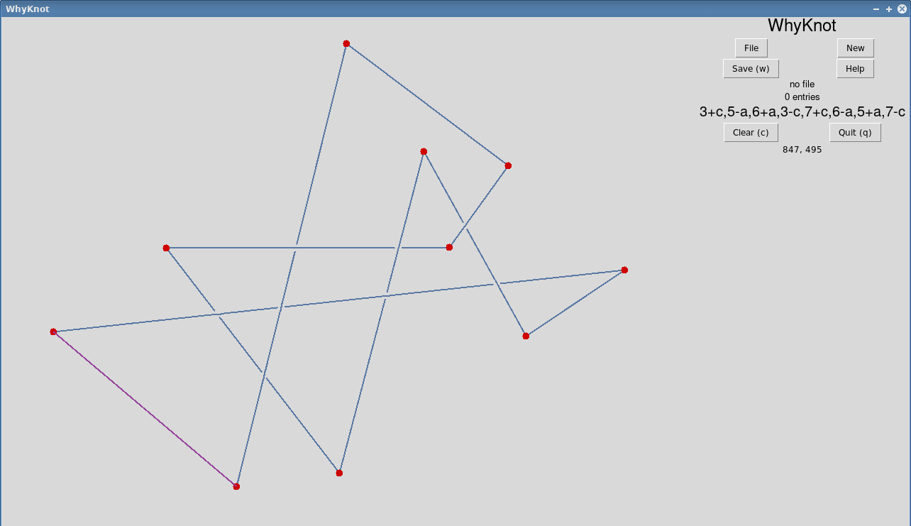
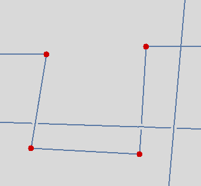
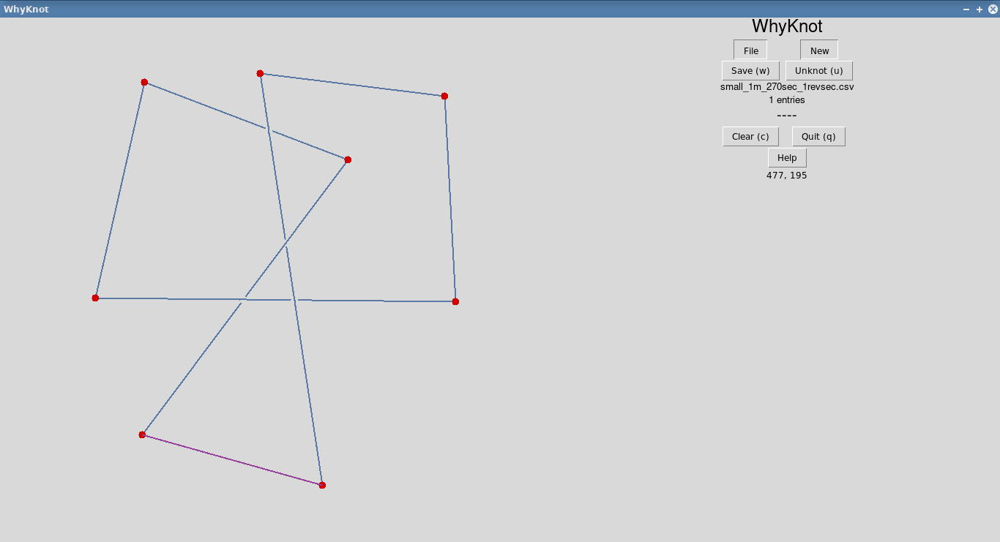

[](https://github.com/ambv/black)

 _________
< whyknot >
 ---------
        \   ^__^
         \  (oo)\_______
            (__)\       )\/\
                ||----w |
                ||     ||

# whyknot

Very simple program which allows you to draw knots and extract knot parameters.

This package is really a wrapper over the excellent [pyknotid](https://github.com/SPOCKnots/pyknotid) package which is capable of identifying the important parameters of knots.
That package lacks an easy interface with which to describe knots arising in physical experiments so this hopes to remedy that.
Whyknot provides a canvas upon which to draw 2D representations of 3D knots.
Those knot are automatically analyzed by a pyknotid backend.
The analysis is stored in a CSV file and the raw knot coordinates are stored in a json file.

If you use this project in your own research, please cite us (as well as pyknotid):

**Xavier Capaldi and Luc Capaldi. whyknot tkinter-based interface to pyknotid. https://github.com/xcapaldi/whyknot, 2019. Accessed YYYY-MM-DD.**

bibtex format:

```bibtex
@Misc{whyknot,
  author = {Xavier Capaldi and Luc Capaldi},
  title = {pyknotid knot identification toolkit},
  howpublished = {\url{https://github.com/xcapaldi/whyknot}},
  note = {Accessed YYYY-MM-DD},
  year = 2019,
}
```

Also check out Kyle Miller's [KnotFolio](https://github.com/kmill/knotfolio) which has similar functionality and can import images.

# Screenshots

Main interface:



3D plotting for checking if you've drawn knot properly:


# Notes on use

## Installation

This package was written in python3 so of course that will be required.
All developement was done on a GNU/Linux machine a several other packages are required.
On Fedora Linux the following packages are necessary:

* python3-tkinter
* python3-devel
* gcc

You should be able to find equivalents in most GNU/Linux distributions.
Once installed you can use pip3 to install the required python packages.
Try pip3 -r requirements.txt

I honestly am not sure how easy it is to get this system running on a Windows or Mac.
If you have any experience, let us know so we can update this document for other users!

## Usage

Assuming you have successfully installed all dependencies, you can start Whyknot with python3 whyknot.py

You can either make a new file to store knot data with New or open a previous file with File.
In either case, the main file stores the initial pyknotid analysis in CSV format.
In addition, whyknot should generate a folder in the same directory which will contain individual JSON files containing the coordinates of each knot.

You can click on the canvas area to draw nodes which will automatically be connected.
You will notice that a purple closure line is automatically drawn.
In our code, the closure line is always drawn above everything else (in the z-axis).
Because of this, we recommend you finish drawing your knot such that the closure line doesn't intersect with anything.
This makes it easier for you to ensure you've drawn the correct knot.

Whenever normal lines intersect, an indicator is drawn to show which line is above or below the other.
You can click on that intersection to switch the top line with the bottom.
On the right, you will see a simplified Gauss code displayed if your knot is not an unknot (phew).

You can save your knot to the active file with Save or by pressing w.
Before saving you check if the 3D structure is correct by pressing p (for plot).
It may look strange to you but this is actually an accurate representation of the knot data and the analysis can handle all these weird bridges correctly.
You can clear the previous knot with Clear or c.
You can also quit the application with Quit or q.
After saving some knots, you will find your CSV file contains three elements per row:

* The simplified Gauss code
* The crossing number
* The Alexander polynomial

These are all generated using the coordinates you drew passed through the analytic functions packaged in pyknotid.

## Known bugs

### No bridge

Occasionally no bridge will be placed at a junction as can be seen in the figure below.
The reason for this is still unknown.
Redrawing the knot usually results in the correct format.



### Knot identified as unknot

Sometimes a known knot is identified as an unknot like in the figure below.
This is remedied by redrawing the knot.
The pyknotid backend will usually identify successfully on the second attempt.



## Contributor guidelines

Try to follow PEP8 guidelines as much as possible (except that black line length defaults are used; 88 chars).
We also require the following to merge changes:

* Run pip3 freeze > requirements.txt to generate an updated requirements.txt
* Run black to autoformat your code following PEP8 convention.

Otherwise just try to comment your work clearly.

## License

This software is under the MIT license which is extremely permissive and allows anyone to use and modify it freely.

